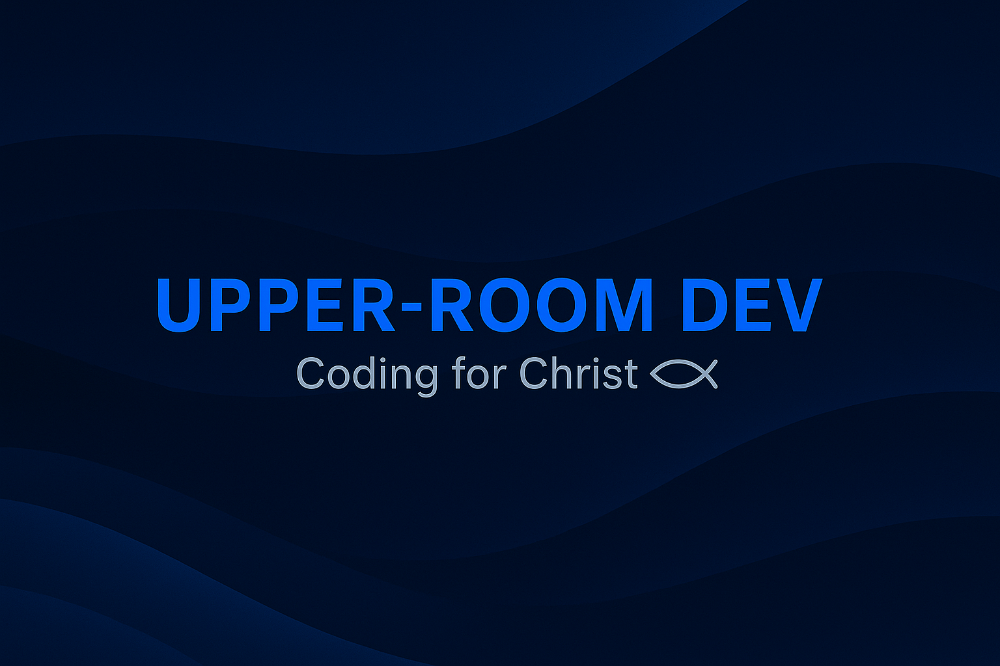

# Upper-Room Dev
**Coding for Christ.** A community and think tank of like-minded Christian coders, engineers, and creators who build with purpose.

## Who we are
Upper-Room Dev is a collective of believers in the tech world — software developers, systems engineers, AI builders, and creative technologists — united by our faith in Christ and our desire to glorify Him through our work.  
We share patterns, tools, and ideas that help one another create systems that are excellent, ethical, and eternal in impact.

## What we do
- **Collaborate** on open-source and private projects that serve the Kingdom and the communities we live in.
- **Publish** technical patterns, agentic workflows, and AI integration strategies rooted in good stewardship.
- **Encourage** each other in faith, skill growth, and discipline — building up the body of Christ in the tech space.
- **Mentor** the next generation of coders and creators with biblical principles and practical experience.

## Core principles
- **Christ-centered**: Our ultimate goal is to glorify God with our talents.
- **Excellence**: Build as though you’re building for the Lord — clean, reliable, and well-documented.
- **Service**: Use technology to bless others, not exploit them.
- **Integrity**: Truth in code, truth in conduct.

## Join the work
If you share the vision of coding for Christ, you’re welcome here.  
Contribute to a repo, propose a project, or connect with us in our discussions.

**Tagline:** Coding for Christ
